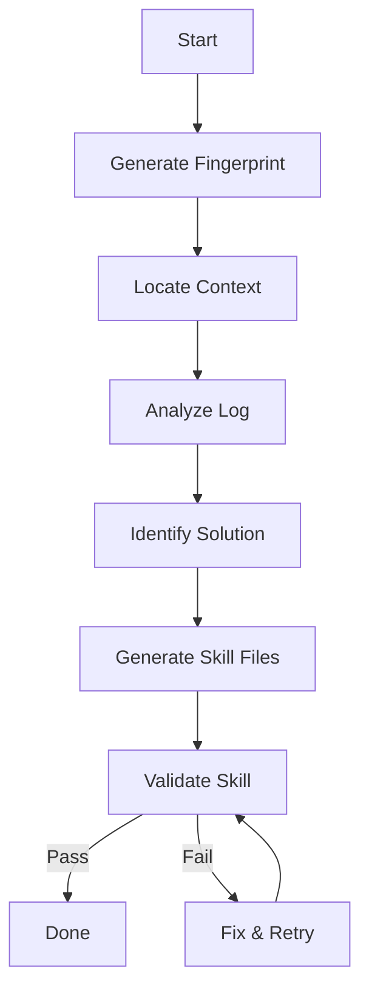

# Experience Crystallizer

This skill enables you to perform **Self-Learning** by creating standardized skills compliant with the **Agent Skills Specification**.

## Trigger Criteria (WHEN TO USE)

**CRITICAL: Do NOT use this skill for trivial tasks.**

You should ONLY use this skill if the current session meets at least one of these criteria:
1.  **Trial & Error**: You failed at least once (e.g., SyntaxError, logic error, wrong API usage) and had to fix it.
2.  **Discovery**: You had to read external documentation or search the web to find a non-obvious solution.
3.  **Complexity**: The solution required multiple steps or specific configurations that are hard to remember.

*If the task was completed successfully on the first try with common knowledge, DO NOT create a skill.*

## Workflow (Decision Flow)



## Output Specification (Agent Skills Standard)

You must create the new skill in `skills/learned/<skill-name>/` with the following structure.

### 1. Directory Structure
```text
skills/learned/<skill-name>/
  ├── SKILL.md            # [Required] Entry point
  ├── scripts/            # [Optional] Executable tools (was helpers/)
  ├── references/         # [Optional] Detailed docs
  └── assets/             # [Optional] Static resources
      └── examples/       # [Recommended] Read-only code (.example)
```

### 2. Validation Rules (Strict)

-   **Name**: `SKILL.md` frontmatter `name` must match the directory name. Lowercase, hyphens only.
-   **Code Isolation**: Files in `assets/examples/` MUST end with `.example`.
-   **Executable**: Place agent tools in `scripts/`.
-   **Documentation**:
    -   Keep `SKILL.md` concise (< 500 lines).
    -   Use Mermaid flowcharts for logic.
    -   Include `## Common Pitfalls`.

## Step-by-Step Implementation

1.  Read log analysis.
2.  Determine Root Cause & Solution.
3.  Write `SKILL.md` and auxiliary files.
4.  **RUN `validate_generated_skill`**. Fix any errors reported.
