# Self-Learning Skills: Teaching Agents to Crystallize Experience

> *Based on original notes: [README.draft.md](./README.draft.md)*

> *"What if an AI agent could learn from its own trial-and-error, just like humans do?"*

This project explores a novel approach to agent self-improvement: enabling AI agents to **automatically distill hard-won problem-solving experiences into reusable skills**.

---

## 1. The Agentic Bot as a State Machine Explorer

At its core, an agentic bot is an explorer navigating an unknown world. Each interaction can be modeled through the lens of **Reinforcement Learning**:

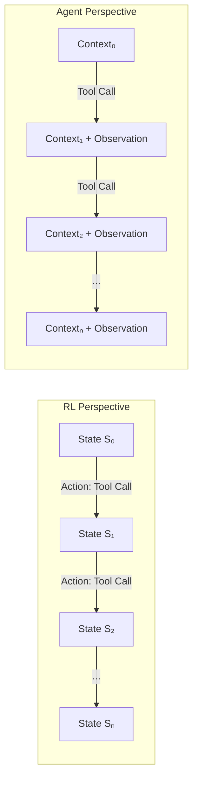

| RL Concept | Agent Equivalent |
|------------|------------------|
| **State** | Current context window |
| **Action** | Tool call / API invocation |
| **Observation** | Tool output / New information |
| **Reward** | Task completion signal |
| **Policy** | The LLM's reasoning |

The agent's exploration is fundamentally a **policy-based search** through an enormous state space, where each tool call is an action that yields new observations, incrementally building understanding of the problem domain.

---

## 2. Why Complex Problems Are Hard: A Formal Understanding

Complex problems manifest in several ways that challenge agent capabilities:

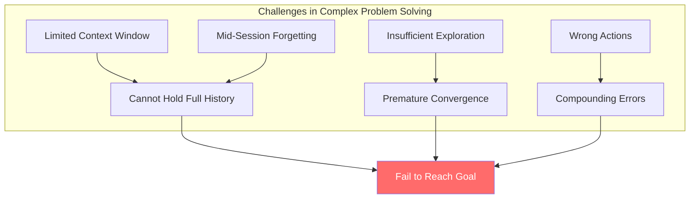

### The Core Difficulty

1. **Bounded Exploration**: Context limits restrict how much trial-and-error an agent can perform
2. **Action Correctness Uncertainty**: Each step may be correct or incorrect; errors compound
3. **Memory Degradation**: Important early context may be "forgotten" in long sessions
4. **Patience Deficit**: Agents may not exhaustively explore before committing to a solution

The result: complex problems require extensive trial-and-error that exceeds practical context limits, or demand many costly mistakes before reaching the goal.

---

## 3. Skills: Shortcut Edges in the State Graph

### What Is a Skill?

Imagine the agent's exploration as traversing a directed graph, where nodes are states and edges are actions. A **skill** is essentially a **pre-computed shortcut edge** drawn by an oracle (human expert or prior successful agent) that directly connects a problem state to its solution state.

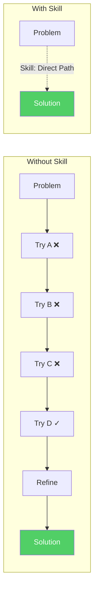

### Self-Generated Skills: The Key Insight

If skills are shortcut edges, then **self-generated skills** are the agent's ability to:

1. **Identify** a valuable exploration path (one with significant trial-and-error)
2. **Extract** the problem definition and verified solution
3. **Package** reusable helpers and reference materials
4. **Store** everything in a retrievable format

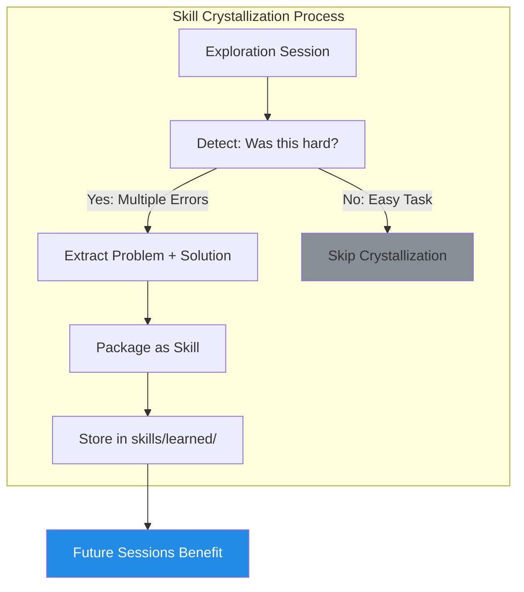

---

## 4. The Meta-Skill: Experience Crystallizer

The `experience-crystallizer` is a **meta-skill**: a skill that teaches the agent how to create other skills.

### Design Principles

| Principle | Rationale |
|-----------|-----------|
| **Structured Output** | Skills follow a consistent file format for reliable parsing |
| **Progressive Disclosure** | `SKILL.md` provides overview; details in `references/` |
| **Executable Helpers** | `scripts/` contains reusable tools |
| **Safe Examples** | `.example` extension prevents accidental execution |

### Critical Guard: The "Struggle Threshold"

**⚠️ IMPORTANT**: Not every task deserves a skill.

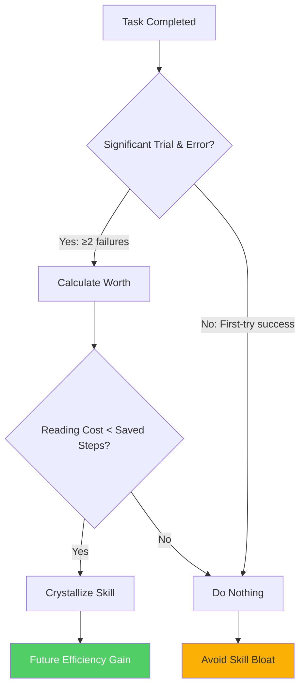

**Why this matters**: Our experiments show that crystallizing trivial tasks actually **increases cognitive load** — the agent spends more effort reading skills than it saves. Skills have a **zero-shot learning cost**; they're only worthwhile when that cost is amortized over genuine complexity.

### Formalized Decision Criterion

A skill is worth creating only if:

$$
\text{ReadingCost}(\text{skill}) < \text{StepsSaved}
$$

Where:
- **ReadingCost** = f(depth, content_volume) — a weighted function of skill hierarchy depth and total content size
- **StepsSaved** = Original exploration steps − Expected steps with skill

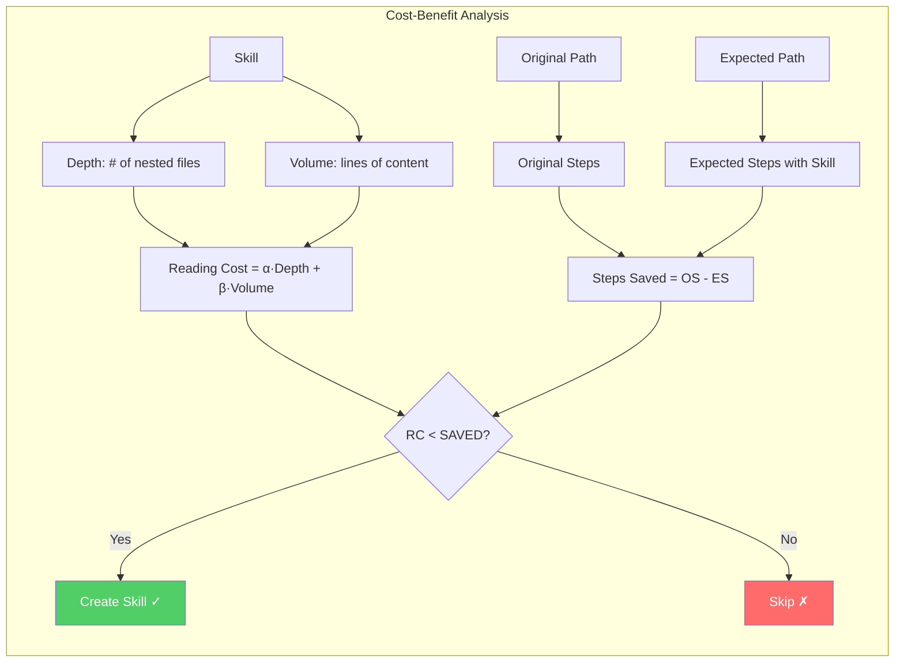

**Practical heuristic**: If a skill requires reading 3+ files with 200+ total lines, it should save at least 5-10 exploration steps to be worthwhile.

### Experimental Validation

We constructed a moderately complex test case (parsing a corrupted binary file) and compared performance:

| Metric | Without Skill | With Skill | Improvement |
|--------|--------------|------------|-------------|
| Steps | 15 | 10 | **33% ↓** |
| Tool Calls | 14 | 9 | **36% ↓** |
| Files Created | 4 | 1 | **75% ↓** |
| Output Quality | ✓ Excellent | ✓ Excellent | Identical |

The skill provided **contextual enhancement** — the agent made better decisions by understanding what had worked before.

---

## 5. Open Problems & Future Directions

### Current Limitations

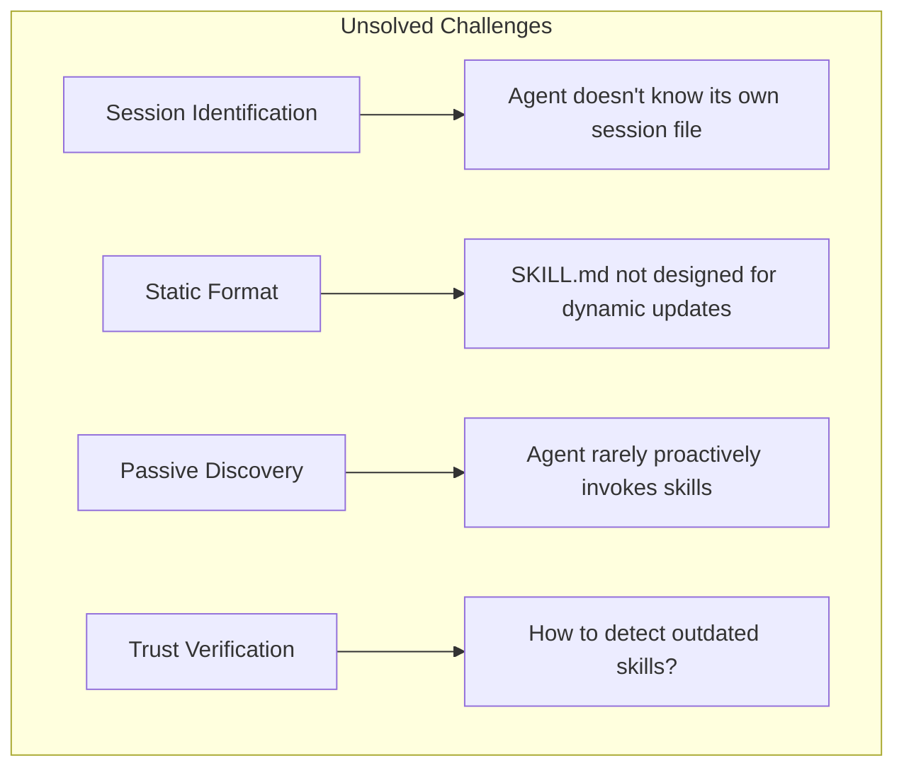

### Proposed Solutions: The Skill Bank

A **Skill Bank** would address these issues through:

1. **Usage Tracking**: Record when and how each skill is used
2. **Outcome Logging**: Store success/failure cases per skill
3. **Staleness Detection**: Flag skills that consistently fail
4. **Active Exploration**: Encourage trying alternative methods to enrich examples
5. **Update Protocols**: Define when and how to revise skills

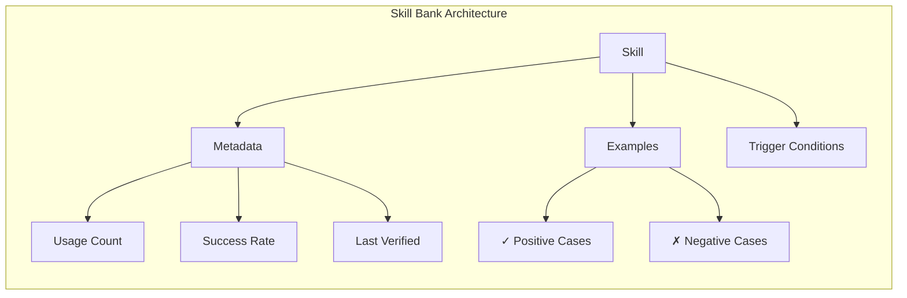

### Research Connections: Active Context Compression

This work shares deep connections with **Active Context Compression** research — both aim to preserve essential information while discarding noise. The goals are fundamentally equivalent:

| This Project | Context Compression |
|--------------|---------------------|
| Crystallize valuable exploration paths | Compress reasoning traces |
| Discard failed attempts | Remove redundant tokens |
| Preserve verified solutions | Retain critical information |

**The Invocation Problem**: A key challenge is that skills, no matter how well-documented, are rarely *proactively* invoked by agents. This mirrors the difficulty in training models to actively compress their own context. Potential synergies include:

- Training models to recognize when to invoke learned skills
- Developing intrinsic motivation for skill-based shortcuts
- Learning compression policies that preserve actionable knowledge

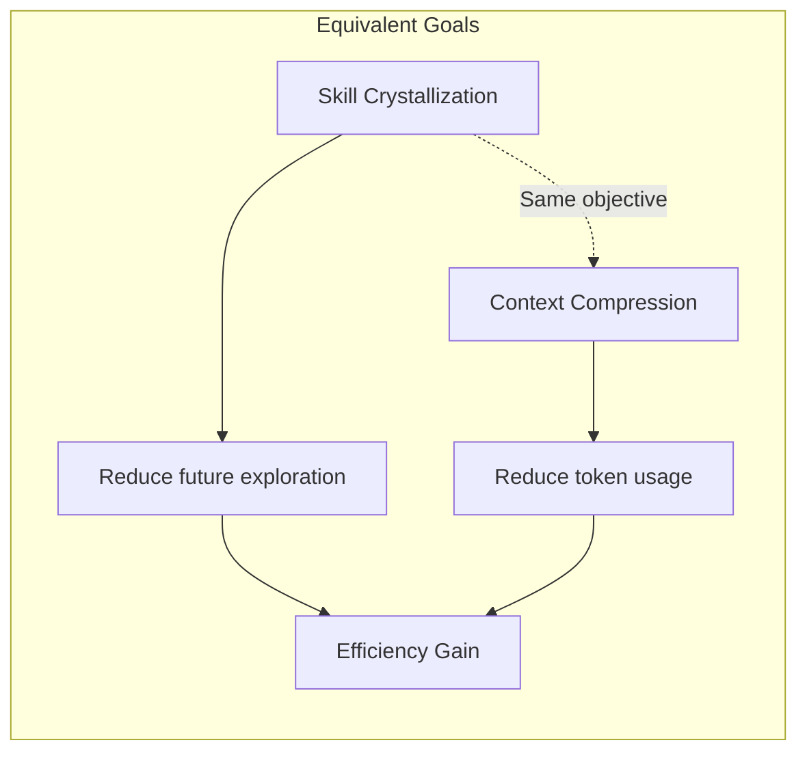

### Future Opportunities

Beyond the Skill Bank, several exciting directions emerge:

#### 1. Training-Free Distillation

Advanced models can write skills like **martial arts manuals** — codified wisdom that weaker models can follow:

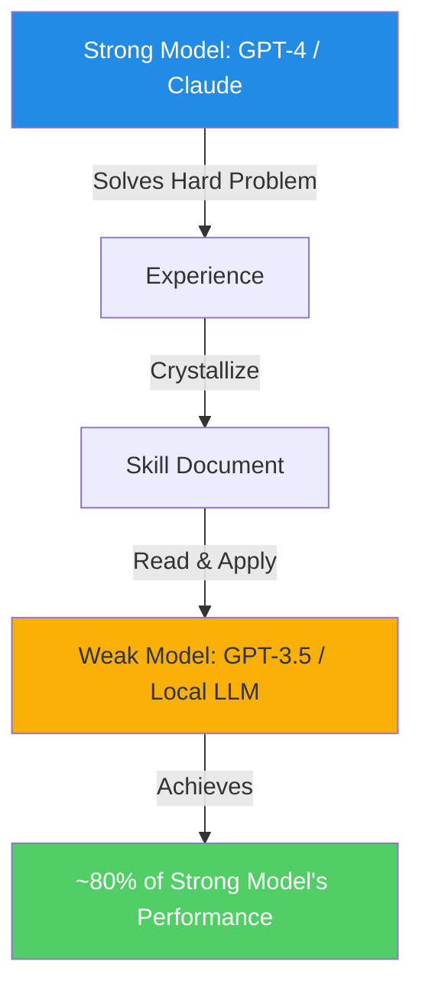

This enables **capability transfer without fine-tuning** — the skill acts as a bridge between model tiers.

#### 2. Training-Free Domain Adaptation

With efficient update protocols, a Skill Bank enables **personalized few-shot learning**:

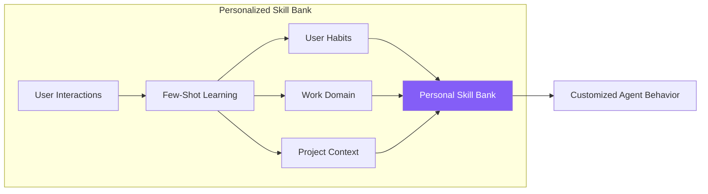

This achieves **domain adaptation without training** — the agent learns user preferences, work patterns, and domain knowledge through accumulated skills rather than weight updates.

### Deployment Note

This skill system has been embedded into a **Screeps game agent** as a real-world testbed. Empirical results from this deployment are pending.

---

## Quick Start

```bash
# After a hard-won debugging session, ask the agent:
"Summarize this debugging experience into a skill"

# The agent will:
# 1. Locate the session log
# 2. Analyze errors and solutions
# 3. Generate a new skill in skills/learned/
```

## Project Structure

```
self-learn-skills/
├── skills/
│   ├── experience-crystallizer/   # The meta-skill
│   │   ├── SKILL.md               # Skill definition
│   │   └── scripts/               # Helper tools
│   └── learned/                   # Auto-generated skills
├── papers/                        # Related research
└── README.md                      # This document
```

---

## Contributing

1. Work on a challenging task
2. Successfully solve it after some struggle
3. Ask the agent to crystallize the experience
4. Review and refine the generated skill
5. Submit a PR with the new skill

---

*"The best time to document a solution is right after you've struggled to find it."*

