# 自学习技能系统：赋予智能体经验结晶能力

> *基于原始草稿：[README.draft.md](./README.draft.md)*

> *"如果 AI 智能体能够像人类一样从试错过程中学习，会产生怎样的结果？"*

本项目探索一种智能体自我提升的新颖方法：使 AI 智能体能够**自动将艰难获取的问题解决经验提炼为可复用的技能**。

---

## 目录

1. [智能体作为状态机探索器](#1-智能体作为状态机探索器)
2. [复杂问题的困难性：形式化理解](#2-复杂问题的困难性形式化理解)
3. [技能：状态图中的捷径边](#3-技能状态图中的捷径边)
4. [元技能：Experience Crystallizer](#4-元技能experience-crystallizer)
5. [开放问题与未来方向](#5-开放问题与未来方向)

---

## 1. 智能体作为状态机探索器

从本质上讲，Agentic Bot 是一个在未知世界中探索的探索者。每次交互都可以通过**强化学习（Reinforcement Learning）** 的视角进行建模：

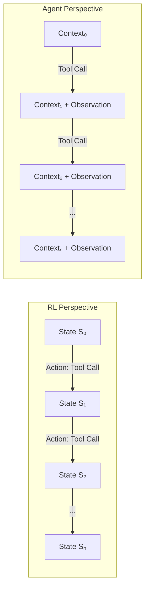

| RL 概念         | 智能体对应概念          |
| --------------- | ----------------------- |
| **State**       | 当前上下文窗口          |
| **Action**      | Tool Call / API 调用    |
| **Observation** | 工具输出 / 新信息       |
| **Reward**      | 任务完成信号            |
| **Policy**      | LLM 的推理过程          |

智能体的探索本质上是一种**基于策略的搜索（policy-based search）**，在庞大的状态空间中进行。每次 tool call 都是一个产生新观测的动作，逐步构建对问题域的理解。

---

## 2. 复杂问题的困难性：形式化理解

复杂问题以多种方式挑战智能体的能力：

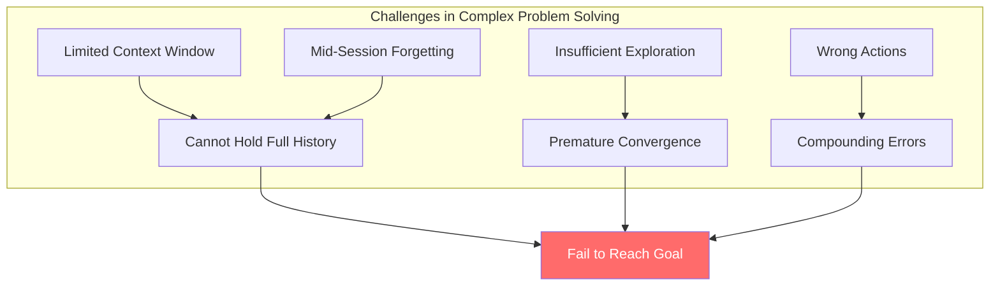

### 2.1 核心困难

1. **有界探索（Bounded Exploration）**：上下文窗口容量有限，当其被填满时会触发上下文压缩；默认的压缩算法不可避免地损失部分信息，导致早期探索经验丢失
2. **动作正确性不确定（Action Correctness Uncertainty）**：每一步都可能正确或错误；错误会累积
3. **记忆退化（Memory Degradation）**：长会话中，早期的重要上下文可能被"遗忘"
4. **耐心不足（Patience Deficit）**：智能体可能在提交解决方案之前未能充分探索

**结论**：复杂问题需要超出实际上下文限制的大量试错，或者在达到目标之前产生许多代价高昂的错误。

---

## 3. 技能：状态图中的捷径边

### 3.1 技能的定义

将智能体的探索视为遍历有向图，其中节点是状态，边是动作。**技能（Skill）** 本质上是一条由预言者（oracle，如人类专家或先前成功的智能体）绘制的**预计算捷径边**，直接连接问题状态与解决方案状态。

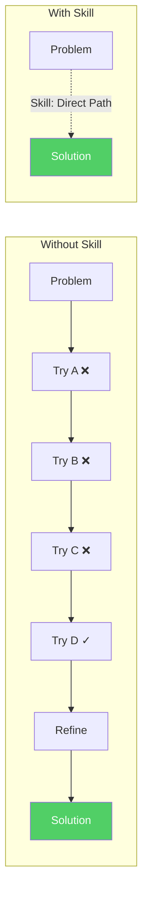

### 3.2 自生成技能：关键洞察

如果技能是捷径边，那么**自生成技能**就是智能体具备以下能力：

1. **识别**有价值的探索路径（包含大量试错的路径）
2. **提取**问题定义和经过验证的解决方案
3. **封装**可复用的辅助工具和参考材料
4. **存储**所有内容为可检索的格式

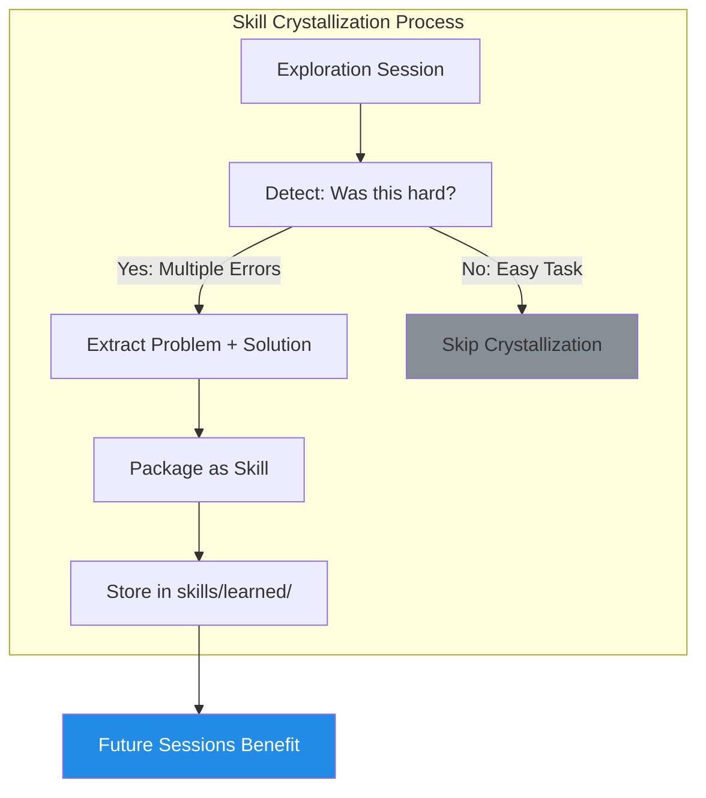

---

## 4. 元技能：Experience Crystallizer

`experience-crystallizer` 是一个**元技能（meta-skill）**：一个教授智能体如何创建其他技能的技能。

### 4.1 设计原则

| 原则                                   | 理由                                           |
| -------------------------------------- | ---------------------------------------------- |
| **结构化输出**                         | 技能遵循一致的文件格式以确保可靠解析           |
| **渐进式披露（Progressive Disclosure）** | `SKILL.md` 提供概览；详细内容在 `references/` 中 |
| **可执行辅助工具**                     | `scripts/` 包含可复用的工具                    |
| **安全示例**                           | `.example` 扩展名防止意外执行                  |

### 4.2 关键守卫机制："挣扎阈值"

> ⚠️ **重要提示**：并非每个任务都值得创建技能。

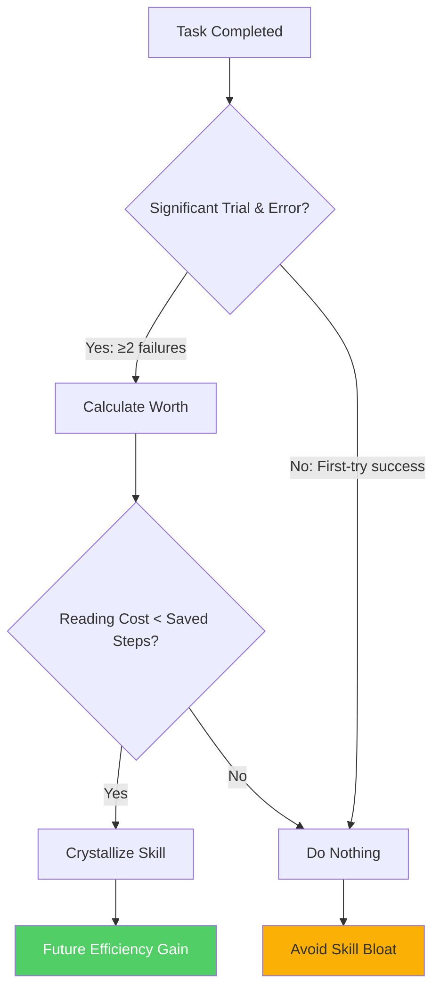

**这一机制的重要性**：我们的实验表明，将琐碎任务结晶化实际上会**增加认知负荷**——智能体花费在阅读技能上的精力超过了节省的精力。技能具有**零样本学习成本（zero-shot learning cost）**；只有当该成本能够通过真正的复杂性来分摊时，技能才具有价值。

### 4.3 形式化决策准则

仅当满足以下条件时，技能才值得创建：

$$
\text{ReadingCost}(\text{skill}) < \text{StepsSaved}
$$

其中：

- **ReadingCost** = f(depth, content_volume) — 技能层级深度和总内容量的加权函数
- **StepsSaved** = 原始探索步数 − 使用技能后的预期步数

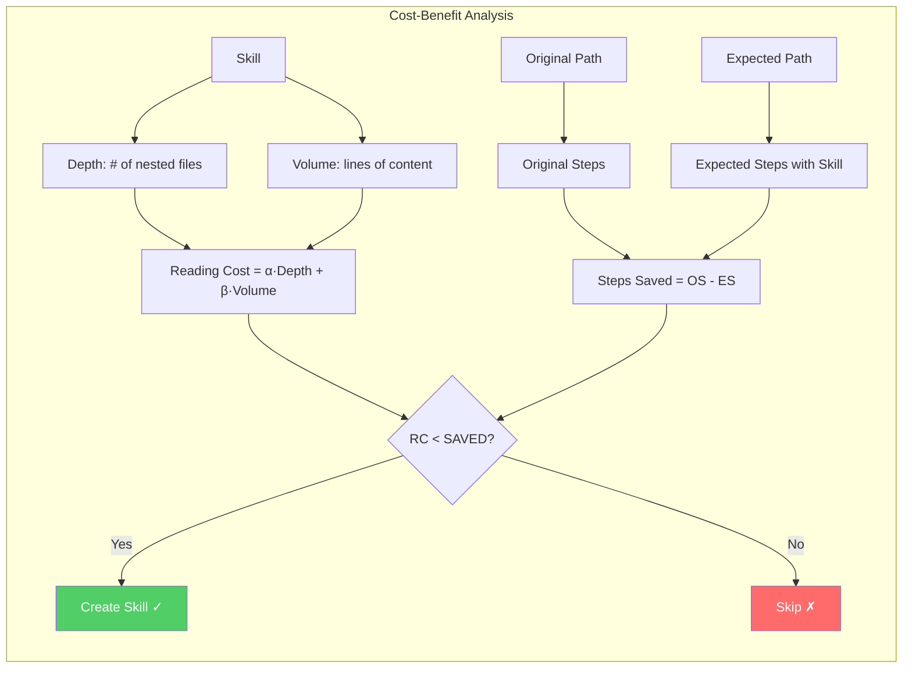

**实用启发式规则**：如果一个技能需要阅读 3 个以上文件且总行数超过 200 行，那么它应该至少节省 5–10 个探索步骤才具有价值。

### 4.4 实验验证

我们构建了一个中等复杂度的测试用例（解析损坏的二进制文件），并比较了性能表现：

| 指标             | 无技能   | 有技能   | 改进幅度  |
| ---------------- | -------- | -------- | --------- |
| 步数             | 15       | 10       | **↓33%**  |
| Tool Calls 次数  | 14       | 9        | **↓36%**  |
| 创建文件数       | 4        | 1        | **↓75%**  |
| 输出质量         | ✓ 优秀   | ✓ 优秀   | 相同      |

技能提供了**上下文增强（contextual enhancement）**——智能体通过理解先前有效的方法做出了更好的决策。

---

## 5. 开放问题与未来方向

### 5.1 当前局限性

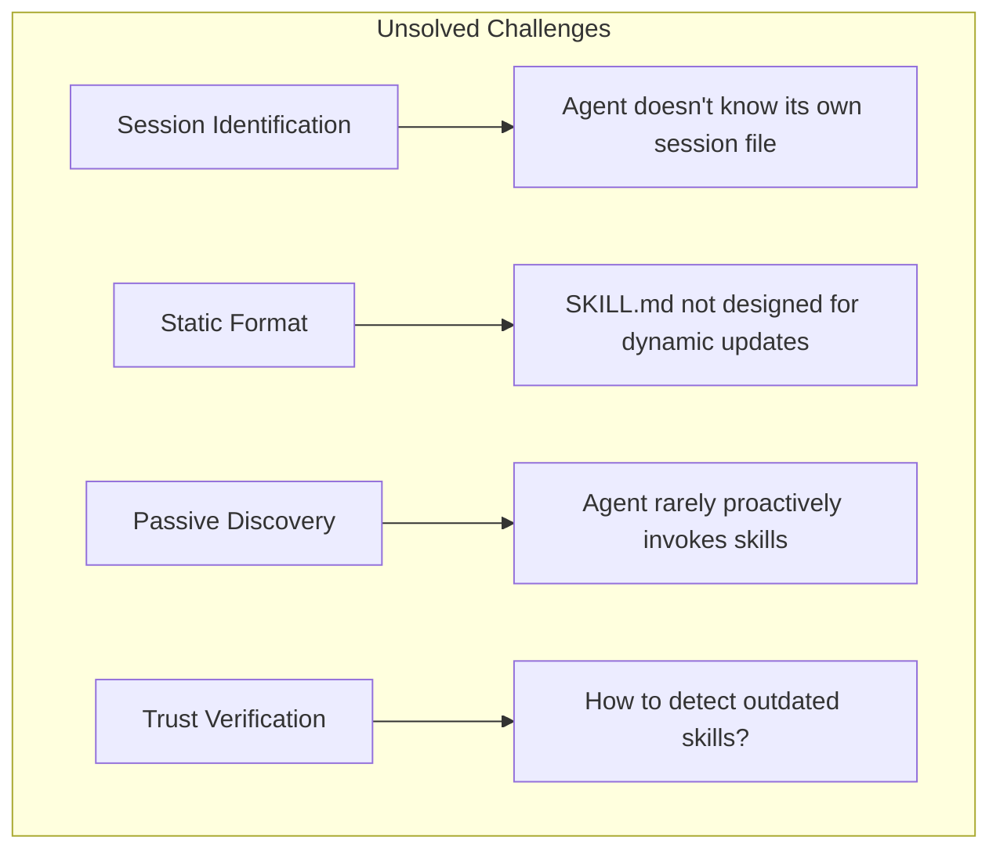

### 5.2 提议的解决方案：Skill Bank

**Skill Bank** 将通过以下机制解决这些问题：

1. **使用追踪（Usage Tracking）**：记录每个技能的使用时间和方式
2. **结果记录（Outcome Logging）**：存储每个技能的成功/失败案例
3. **过时检测（Staleness Detection）**：标记持续失败的技能
4. **主动探索（Active Exploration）**：鼓励尝试替代方法以丰富示例
5. **更新协议（Update Protocols）**：定义何时以及如何修订技能

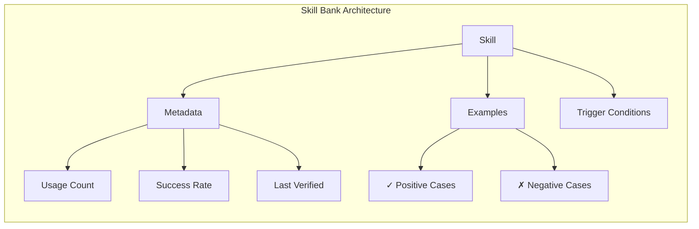

### 5.3 研究关联：主动上下文压缩

本项工作与**主动上下文压缩（Active Context Compression）** 研究具有深层联系——两者都旨在保留关键信息的同时丢弃噪声。其目标本质上是等价的：

| 本项目                   | 上下文压缩           |
| ------------------------ | -------------------- |
| 结晶化有价值的探索路径   | 压缩推理轨迹         |
| 丢弃失败尝试             | 移除冗余 token       |
| 保留验证过的解决方案     | 保留关键信息         |

**调用问题（The Invocation Problem）**：一个关键挑战是，无论技能文档化得多么完善，智能体都很少*主动*调用技能。这与训练模型主动压缩自身上下文的困难如出一辙。潜在的协同方向包括：

- 训练模型识别何时调用已学习的技能
- 开发技能捷径的内在动机（intrinsic motivation）
- 学习保留可操作知识的压缩策略

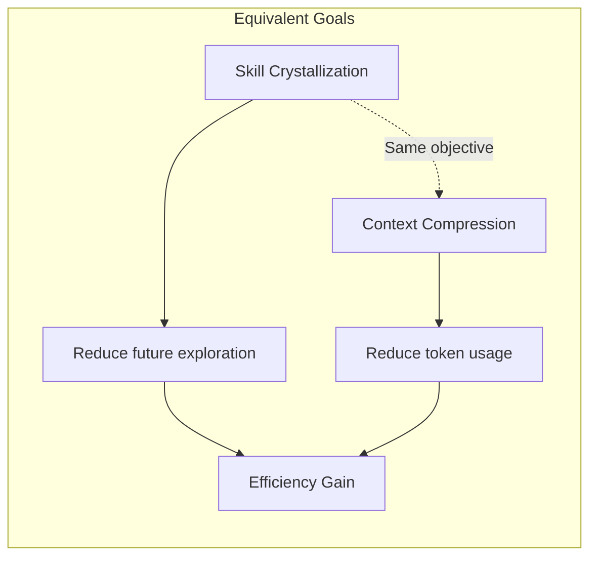

### 5.4 未来机遇

除 Skill Bank 外，还涌现出若干令人兴奋的研究方向：

#### 5.4.1 无需训练的蒸馏

先进模型可以将技能编写为类似**武功秘籍**——编纂的智慧，较弱的模型可以遵循：

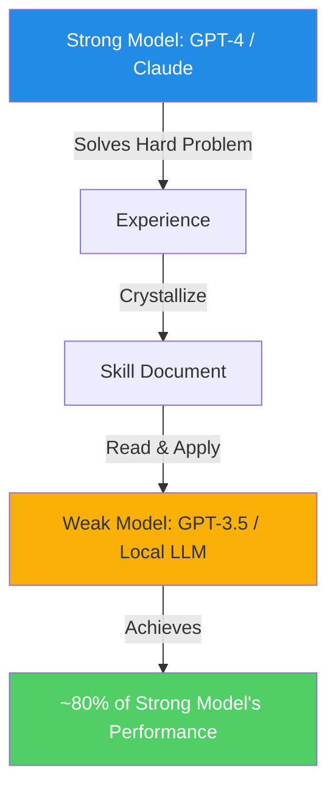

这实现了**无需微调的能力迁移**——技能作为模型层级之间的桥梁。

#### 5.4.2 无需训练的领域适应

通过高效的更新协议，Skill Bank 可实现**个性化小样本学习（personalized few-shot learning）**：

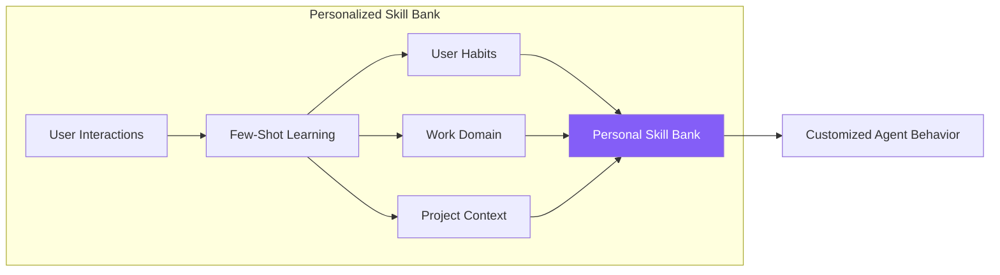

这实现了**无需训练的领域适应**——智能体通过积累的技能而非权重更新来学习用户偏好、工作模式和领域知识。

从更本质的角度审视，对文本文件的更新实际上是在离散空间（自然语言字符空间）上对"模型 + 外部记忆"复合系统进行优化。优化信号源自"任务是否完成"的反馈，该信号经由模型的推理过程（而非梯度反向传播）传导，最终驱动智能体生成对文本文件的更新：

$$
\text{Text} \leftarrow f_{\text{LLM}}(\text{Text}, \text{Feedback})
$$

这可视为一种**外部化持续学习（Externalized Continual Learning）**范式——知识并非编码于模型权重参数中，而是外化为可编辑的文本结构，从而天然规避了传统持续学习中的灾难性遗忘问题。

### 5.5 部署说明

该技能系统已嵌入 **Screeps 游戏智能体**作为实际测试平台。该部署的实证结果尚待整理。

---

## 快速开始

```bash
# 在一次艰难的调试会话后，向智能体提出请求：
"Summarize this debugging experience into a skill"

# 智能体将：
# 1. 定位会话日志
# 2. 分析错误和解决方案
# 3. 在 skills/learned/ 中生成新技能
```

---

## 项目结构

```text
self-learn-skills/
├── skills/
│   ├── experience-crystallizer/   # 元技能
│   │   ├── SKILL.md               # 技能定义
│   │   └── scripts/               # 辅助工具
│   └── learned/                   # 自动生成的技能
├── papers/                        # 相关研究
└── README.md                      # 本文档
```

---

## 贡献指南

1. 处理一个具有挑战性的任务
2. 经过一番努力后成功解决
3. 请求智能体将经验结晶化
4. 审查并完善生成的技能
5. 提交包含新技能的 Pull Request

---

*"记录解决方案的最佳时机，是在你费尽周折找到它之后。"*
