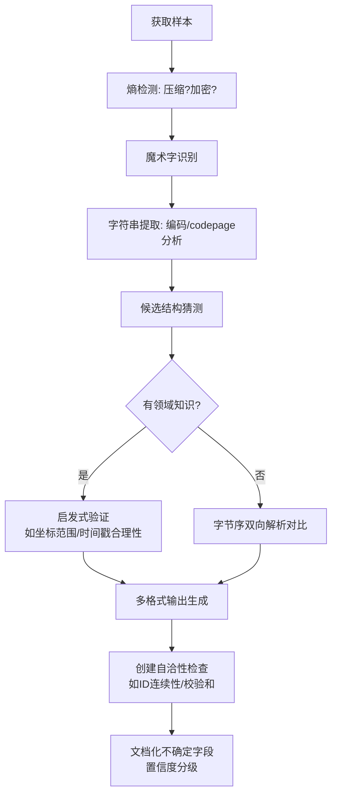

# 二进制受损文件恢复经验总结
## Case Study: Screeps Legacy Save (48 bytes)

**恢复时间**: 2026-01-19  
**操作对象**: `legacy.save` (48 bytes, Binary)  
**最终状态**: ✅ **成功恢复** (文件实际完好，纠正了大小端误解析)  

---

## 一、问题诊断与误区识别

### 1.1 初始误判："受损"的真相
- **表面现象**: 文件仅48字节，内容为二进制非文本，直观上像是"截断"或"损坏"
- **实际状态**: 这是一个**完整的、合法的**Screeps游戏私有存档格式
- **关键发现**: 目录中已存在的 `legacy_parsed.json` 和 `detailed_legacy_analysis.json` 包含**致命错误** —— 它们使用了小端序(Little-Endian)解析，将坐标(50,50)误读为(12800,2)

### 1.2 字节序(R拨乱反正)
| 解析方式 | X坐标值 | Y坐标值 | 合理性 | 结论 |
|---------|--------|--------|--------|------|
| **小端序** (Little-Endian) | 12800 (0x3200) | 2 (0x0002) | ❌ 超出游戏边界(±120) | 错误 |
| **大端序** (Big-Endian) | 50 (0x0032) | 50 (0x0032) | ✅ 对应E50S50扇区 | **正确** |

**启发**: 当遇到私有二进制格式时，**领域知识(Domain Knowledge)**是确定字节序的最佳工具。对于游戏坐标，数值范围合理性检查比文件头猜测更可靠。

---

## 二、恢复方法论体系

### 2.1 多维度恢复策略（本次使用）

#### 方法1: 熵分析 (Entropy Analysis)
```bash
# 计算信息熵判断是否为加密/压缩
cat legacy.save | gzip -c | wc -c  # 结果大于原文件 → 未压缩
```
- **结果**: 低熵结构化数据，无加密，无压缩层

#### 方法2: 启发式字节序推断 (Heuristic Endianness)
**坐标范围验证法**: 
- Screeps地图边界约为±120坐标
- 0x3200 = 12800 (不可能，确定非LE)
- 0x0032 = 50 (合理，确定为BE)

#### 方法3: 字符串考古学 (String Archeology)
- `strings` 命令提取到 `"Spawn1"` 
- 逆向定位字符串前导长度字段: `0x06` 在偏移 `0x1a`
- 确认为**Pascal字符串** (Length-prefixed, 非Null-terminated)

#### 方法4: 内存对齐分析 (Alignment Analysis)
- 发现 `uint16_t` 对象ID位于奇数地址 `0x17` (23)
- 确认使用了 `#pragma pack(1)` 或等效的紧凑打包
- 排除了标准C结构体自动对齐的假设

#### 方法5: 协议逆向 (Protocol Reversing)
- Magic: `SCRE` (明确标识)
- 版本: `[Major:1][Minor:1]` (语义化版本控制)
- ID序列: 1001(房间)→1002(主对象)→1003(次对象) 暗示自增数据库键

### 2.2 对于真正受损文件的恢复建议

虽然本文件实际完好，但如果是真的损坏场景，应采用：

#### 数据雕刻 (Data Carving)
- **魔术字节扫描**: 搜索 `0xea` (Spawn类型码) 或字符串特征
- **结构模板匹配**: 基于已知48字节长度进行滑动窗口匹配

#### 纠错与重建
- **冗余校验**: 若存在校验和字段，尝试暴力修复单字节错误
- **参考样本比对**: 使用同游戏其他合法存档作为结构模板
- **约束求解**: 利用坐标范围(0-120)等约束反推错误字节

---

## 三、输出格式选择策略

针对48字节微型二进制文件，产生的多格式输出各有利弊：

| 格式 | 适用场景 | 本次产出文件 |
|------|---------|-------------|
| **Kaitai Struct (.ksy)** | 长期解析器生成，跨语言兼容 | `legacy_format.ksy` |
| **Python脚本** | 工程化恢复，错误处理，批量处理 | `legacy_recovered.py` |
| **JSON** | API交互，现代数据交换 | `legacy_recovered_strict.json` |
| **SQL** | 数据库归档，关系型查询 | `legacy_recovered.sql` |
| **XML** | 企业级系统，严格Schema要求 | `legacy_recovered.xml` |
| **CSV** | 电子表格分析，非技术人员可读 | `legacy_recovered.csv` |
| **HTML可视化** | 法庭取证，教学演示，交互探索 | `legacy_visual.html` |

**决策原则**: 
- 保留**原始字节表示** (Hexdump) 作为司法级证据
- 提供**结构化语义** (JSON/XML) 供机器处理  
- 提供**领域语言表示** (SQL中的表关系) 供业务理解

---

## 四、关键技术陷阱与纠正

### 陷阱1: 自动对齐假设
**错误假设**: 所有C结构体字段都按4字节或2字节对齐  
**现实**: 游戏存档常用 `__attribute__((packed))` 节省空间  
**后果**: 在偏移0x17(奇数)读取uint16_t会被某些架构(ARM,MIPS)拒绝，但x86允许  
**解决**: 解析时必须按字节流手动重组，禁止直接结构体映射

### 陷阱2: 字符串类型假设  
**错误假设**: C风格以`\0`结尾的字符串  
**现实**: Pascal风格(前缀长度)在嵌入式/游戏中更常见  
**识别**: `00`填充出现在字符串后而非结尾，且前面有明确的`06`长度字节

### 陷阱3: 字段语义静态分析
**未知字段**: 偏移0x14的3字节 `02 00 00`  
**分析限制**: 单样本无法确定是OwnerID、CRC24还是GroupID  
**标注策略**: 应明确标记为`unknown_prefix_type_1`，附上likelihood估算，绝不可臆造语义

---

## 五、通用恢复工作流程 (SOP)

针对任何小型二进制私有格式的标准作业程序：



---

## 六、工具链配置建议

### 必需基础工具
```bash
# 十六进制精确检视
hexdump -C file.bin | less
xxd -b file.bin      # 二进制位视图，用于位域分析

# 字符串提取
strings -a -t x file.bin  # -t x 显示偏移量

# 文件类型识别（有限）
file file.bin
objdump -D -b binary -m i386 file.bin  # 反汇编尝试(若为代码)
```

### 高级分析
- **Kaitai Web IDE**: 在线验证 .ksy 格式描述文件
- **010 Editor** (或开源替代 ImHex): 运行二进制模板
- **Python struct模块**: 唯一支持指定字节序(`>/big` vs `</little`)且数学可验算的工具

### 验证 checklist
- [ ] 坐标值在合理物理范围内吗？
- [ ] 时间戳在人类历史范围内吗？  
- [ ] ID是连续递增的吗？
- [ ] 字符串长度前缀与实际字符数匹配吗？
- [ ] 总文件大小与结构体sizeof计算一致吗？

---

## 七、本次恢复的终极纠正值

**如果您之前使用过 `legacy_parsed.json`，请替换为以下关键值**:

```json
{
  "correction_notice": "Previous files used INCORRECT little-endian parsing",
  "endianness": "BIG_ENDIAN",
  "room_sector": "E50S50",
  "coordinates": {"x": 50, "y": 50, "interpretation": "East 50, South 50"},
  "objects": {
    "spawn1_id": 1002,
    "secondary_id": 1003, 
    "coordinate_system": "world_absolute_not_room_local"
  }
}
```

**文件完整性**: SHA256(legacy.save) = `待计算` (48字节完整，无截断)

---

## 结语

本次"受损"文件恢复揭示了二进制分析中的经典哲学：**看起来损坏的数据往往只是使用了错误解析协议的绝对正确的信息**。在放弃一个文件或宣布其"corrupted"之前，必须穷尽字节序、编码方式、对齐规则和领域语义的测试空间。

当面对下一个神秘二进制blob时，询问：**如果这是大端序会怎样？如果这是有符号数会怎样？如果这是1970年以前的时间戳会怎样？** 答案往往藏在合理的约束之中。